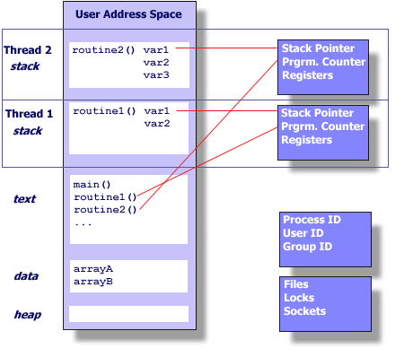

- 참고할 링크들
  - [튜링머신](https://en.wikipedia.org/wiki/Multitape_Turing_machine)
  - [스택머신](https://users.ece.cmu.edu/~koopman/stack_computers/sec3_2.html)

# 목차
## in the beginning was the bit.
- 0, 1
  - 컴퓨터는 무한한 0과 1의 반복
- 8 bit CPU
  - 컴퓨터가 0과 1을 8bit씩 읽는다.
  - ALU: 명령어(instruction) opcode(operation code)
    - 00000000 - NONE
    - 00000001 - ADD - 더하기              - 인자 2개를 원함. 
    - 00000010 - SUB - 빼기
    - 00000011 - MUL - 곱하기
    - 00000100 - DIV - 나누기
    - 예제 
      - 2 + 3
        - B => 00000010 00000010 00000011
        - D => 1 2 3
        - H => 1 2 3
      - 5 * 7
        - B => 00000011 00000101 00000111
        - D => 3 5 7
        - H => 3 5 7
  - REGISTER - 계산한 값을 저장
    - 
    -(조사 필요~~~) 8bit momory
    - data register
      - A, B, C, D
      - 주소와 값 저장 
      - MOV A 10 => A register에 10을 저장
      - MOV B A  => A register의 값을 B register에 저장
        - example
          - A = 1 + 2
            - ??? => 계산한 결과값을 저장할 곳이 없다!!!
            - MOV A, 00000001
            - ADD A, 00000010
            - 이런 느낌?
            ```java
              int a = 1;
              int b = 2;
              //swap
              int tmp = a;
              int a = b;
              int b = tmp;
            ```
  - IP register <= 요놈 때문에 cpu 설명  - intel용어 일반적으로 PC register
    - 현재 명령어가 실행되고 있는 메모리의 번지의 값을 저장.
    - (에뮬레이터를 보여주면서 IP register와 instruction block을 설명.)
    - [8bit emulator](https://boojongmin.github.io/assembler-simulator/index.html)
  - SP register 
    - stack pointer  
  - FLAG register
    - [flags register](https://en.wikipedia.org/wiki/FLAGS_register)
    - Z(Zero)
    - CMP A, B
      - if A = B : Z register is 1
      - if A != B : Z register is 0
  - 참고
    - 
    - [x64 opcode list](http://ref.x86asm.net/coder64.html)
- RAM
  - 주기억장치
  - Adress
  - 2^8 = 256
  - MOV [10], 7
  - MOV A, 10; MOV [A], 7
    ```assembly
      MOV [224], 17
      MOV [225], 17
      MOV [226], 17
      MOV [227], 17
      MOV [228], 17
      MOV [229], 17
      MOV [230], 17
      MOV [231], 17
      MOV [232], 65
      MOV A, 232
      MOV [A], 97
      MOV [A+1], 98
      MOV [A+2], 99
      MOV [A+3], 100
      MOV [A+4], 101
      MOV [A+5], 102
      MOV [A+6], 103
    ```

    ```assembly
      MOV A, 224
      MOV [A], 17
      INC A
      MOV [A], 17
      INC A
      MOV [A], 17
      INC A
      MOV [A], 17
      INC A
      MOV [A], 17
      INC A
      MOV [A], 17
      INC A
      MOV [A], 17
      INC A
      MOV [A], 17
      INC A
      MOV A, 232
      MOV [A], 97
      INC A
      MOV [A], 98
      INC A
      MOV [A], 99
      INC A
      MOV [A], 100
      INC A
      MOV [A], 101
      INC A
      MOV [A], 102
      INC A
      MOV [A], 103
    ```
    ```assembly
      MOV A, 224
      MOV B, 232
      .loop1: 
        MOV [A], 17
        INC A
        CMP A, B
        JNZ .loop1
      MOV A, 232
      MOV B, 97
      .loop2:
        MOV [A], B
        INC A
        INC B
        CMP B, 103
        JNZ .loop2

            HLT 
    ```
  - assembly 코드 설명  
    ```assembly
        JMP start
      hello: 
        DB "HELLO KSUG"
        DB 0	
      start:
        MOV A, 1           
        MOV B, 2	
        ADD B, A
        MOV C, hello
        MOV D, 232
        CALL print   ;  JMP, CALL -> STACK 설명(method 실행 후 return -> 상태 복원)
              HLT    ; Halt  
      print:
        PUSH A
        PUSH B
        MOV B, 0
      .loop:
        MOV A, [C]
        MOV [D], A
        INC C
        INC D
        CMP B, [C]
        JNZ .loop 
        POP B
        POP A
      RET     
    ```  
    
  - 프로세스 설명.  
- (x86 linux를 기준으로) OS
  - DOS vs LINUX
    - 
    - 
    - [midr제작자근황](http://viewfinderer.tistory.com/42)
    - DOS와 LINUX는 파일시스템을 가짐. but...
    - (주제에 관련!) non-mutitasking vs multitasking
    - 는 exe파일을 실행하면 CPU의 제어권이 프로세스로 이전
    - LINUX는 태스크란 개념이 있고 태스크를 관리하는 scheduler가 있어서 OS가 프로세스를 관리함.
- 프로세스
  - 프로그램 - executable file(elf in linux)
  - process
    - 프로그램이 메모리에 로드되어 실행되는 상태
    - 현대적인 프로세스에서는 (페이징 테이블을 통해) 개별적으로 메모리 공간을 가짐.
      - [페이징 테이블](http://boanin.tistory.com/228)
  - process - task + memory로 구분해서 생각해볼 수 있다 ==> 리눅스 전문가 검증 필수
  - C언어 살짝~
    ```c
      #include <stdio.h>
      #include <stdlib.h>

      int global = 0;
      int main() {
        int local = 10;

        global++;
        global--;
        global++;
        printf("global: %d\n", global);


        local++;
        local--;
        local++;
        printf("local: %d\n", local);

        int* heap = (int*)malloc(sizeof(int));
        *heap = 100;
        (*heap)++;
        (*heap)--;
        (*heap)++;
        // *heap = *heap + 1;
        printf("heap: %d\n", *heap);

        return 0;
      }
    ```
    ```shell
    gcc -o a.o a.c
    objdump --disassemble a.o > a.asm
    //elf
    cat a.asm
    ```
    

      - [참고 pthread 내용과 이미지가 좋음](https://computing.llnl.gov/tutorials/pthreads/)
        - Data - 전역변수 - Compile Time에 결정됨.
        - Heap - malloc으로 생성되는 영역(자바에서는 Object) - Run Time에 결정됨.
        - Stack - local 변수 저장.
      - 
      - 
      - 
        - NOTE 위의 이미지는 [NPTL - Native POSIX Thread Library
  ](https://en.wikipedia.org/wiki/Native_POSIX_Thread_Library)은 아님

      - 
      - 
    - stack based register
      - stack?
        - 자료구조
          - In computer science, a data structure is a particular way of organizing data in a computer so that it can be used efficiently
        - bottom에서 top으로 증가 - 저장할때는 push, 사용할때는 pop
      - [call stack](https://en.wikipedia.org/wiki/Call_stack#Call_site_processing)
        - In computer science, a call stack is a stack data structure that stores information about the active subroutines of a computer program.

    - stack size
      ```shell
      # ulimit
      unlimited
      root@1a88797ebf83:~# ulimit -a
      core file size          (blocks, -c) 0
      data seg size           (kbytes, -d) unlimited
      scheduling priority             (-e) 0
      file size               (blocks, -f) unlimited
      pending signals                 (-i) 7763
      max locked memory       (kbytes, -l) 82000
      max memory size         (kbytes, -m) unlimited
      open files                      (-n) 1048576
      pipe size            (512 bytes, -p) 8
      POSIX message queues     (bytes, -q) 819200
      real-time priority              (-r) 0
      -> stack size              (kbytes, -s) 8192
      cpu time               (seconds, -t) unlimited
      max user processes              (-u) unlimited
      virtual memory          (kbytes, -v) unlimited
      file locks                      (-x) unlimited
      ```


- 태스크
  - [process vs thread - 별차이없다 stackoverflow](http://stackoverflow.com/questions/807506/threads-vs-processes-in-linux)

  - fork
    ```shell
      # vi fork.c
    ```
    ```c  
      #include <sys/types.h>
      #include <stdio.h>

      int global;

      void* thread_function(void* arg);

      int main(void)
      {

        int pid = fork();
        printf("process pid: %d\n", pid);
        sleep(10);
        return 0;
      }
    ```
    ```shell
      # ./fork.o &
      [1] 789
      process pid: 790
      process pid: 0    ;789 parent는 0
      process pid: 0
      # pstree -p -s
        bash(1)-+-fork.o(789)---fork.o(790)
                `-pstree(791)
    ```

    ```c
      #include <sys/types.h>
      #include <unistd.h>
      #include <stdio.h>
      #include <stdlib.h>
      #include <sys/syscall.h>

      int global;

      void* thread_function(void* arg);

      int main(void)
      {
        pthread_t p_thread;
        int create_result = pthread_create(&p_thread, NULL, thread_function, NULL);
        create_result = pthread_create(&p_thread, NULL, thread_function, NULL);
        create_result = pthread_create(&p_thread, NULL, thread_function, NULL);
        create_result = pthread_create(&p_thread, NULL, thread_function, NULL);


        printf("main: PID(%d) TID(%d)\n", getpid(), (int)pthread_self());
        pthread_join(p_thread, NULL);

        return 0;
      }

      void* thread_function(void* arg){
        printf("sub : PID(%d) TID(%d)\n", getpid(), syscall(__NR_gettid));
        sleep(10);
      }
    ```

    ```shell
      # gcc -o pthread_create.o pthread_create.c  -lpthread

      # ./pthread_create.o &
      root@1a88797ebf83:~/thread# sub : PID(777) TID(779)
      sub : PID(777) TID(778)
      main: PID(777) TID(-30185664)
      sub : PID(777) TID(780)
      sub : PID(777) TID(781)

      # pstree -s -p
      bash(1)-+-pstree(782)
              `-pthread_create.(777)-+-{pthread_create.}(778)
                                    |-{pthread_create.}(779)
                                    |-{pthread_create.}(780)
                                    `-{pthread_create.}(781)
    ```
  - 프로세스에서 동작 부분 - CPU와 연관
  - 리눅스에서는 task_struct 구조체 [task_struct 분석 블로그](http://blog.naver.com/PostView.nhn?blogId=stonewat&logNo=100064820579)
  - [kernel 2.0.40](http://lxr.free-electrons.com/source/include/linux/sched.h?v=2.0.40#L174)
  - task state - 
  - (tss - Task State Segment) - [참고 why use software context switch in linux](http://stackoverflow.com/questions/2711044/why-doesnt-linux-use-the-hardware-context-switch-via-the-tss)
  - [kernel - sched.h](http://lxr.free-electrons.com/source/include/linux/sched.h#L207)
    ```
      #define TASK_RUNNING            0
      #define TASK_INTERRUPTIBLE      1
      #define TASK_UNINTERRUPTIBLE    2
      #define __TASK_STOPPED          4
      #define __TASK_TRACED           8
      /* in tsk->exit_state */
      #define EXIT_DEAD               16
      #define EXIT_ZOMBIE             32
      #define EXIT_TRACE              (EXIT_ZOMBIE | EXIT_DEAD)
      /* in tsk->state again */
      #define TASK_DEAD               64
      #define TASK_WAKEKILL           128
      #define TASK_WAKING             256
      #define TASK_PARKED             512
      #define TASK_NOLOAD             1024
      #define TASK_NEW                2048
      #define TASK_STATE_MAX          4096
    ```
  - [kernel - task_struct](http://lxr.free-electrons.com/source/include/linux/sched.h#L1511)
  
  - PASS ===> 할 여력이 안됨 스케쥴
  - [참고 링크 - 프로세스 스케쥴러](http://egloos.zum.com/embedded21/v/1876951)
    - 최근 리눅스는 time slice를 써서 time interrup에 의존적이지 않다고함.
  - [참고 링크 - scheduler](http://tturbs.blogspot.kr/2014/10/4.html)
  - [참고 링크 - timer](http://tturbs.blogspot.kr/2014/10/11.html)
  - [task states](http://lxr.free-electrons.com/source/include/linux/sched.h#L207)
  - [kernel source - context switch](http://lxr.free-electrons.com/source/arch/x86/kernel/process_32.c)
  - 선점형 
    - 1Hz - 주파수 1초당 한번
    - [선점 스케쥴링](https://ko.wikipedia.org/wiki/%EC%84%A0%EC%A0%90_%EC%8A%A4%EC%BC%80%EC%A4%84%EB%A7%81)
    - [How does preemption on x86 architecture work?](http://stackoverflow.com/questions/11977640/how-does-preemption-on-x86-architecture-work)
    - 스케쥴링때문에 모은 자료 요새 리눅스는 하드웨어 타이머를 이용한 인터럽트 스케쥴링은 하지 않는다고함. (설명할때 좋은데...)  
      - [HPET](https://ko.wikipedia.org/wiki/%EA%B3%A0%EC%A0%95%EB%B0%80_%EC%9D%B4%EB%B2%A4%ED%8A%B8_%ED%83%80%EC%9D%B4%EB%A8%B8)
      - [RTC - Realtime clock](https://en.wikipedia.org/wiki/Real-time_clock)
      - [PIT - 주기적타이머](https://ko.wikipedia.org/wiki/%EC%A3%BC%EA%B8%B0%EC%A0%81_%ED%83%80%EC%9D%B4%EB%A8%B8)
      - [APIT](https://ko.wikipedia.org/wiki/APIC)
      - [Time Stamp Counter](https://en.wikipedia.org/wiki/Time_Stamp_Counter)
      - [interrupt](http://www.tldp.org/LDP/tlk/dd/interrupts.html)   
      - [interrupt wiki](https://ko.wikipedia.org/wiki/%EC%9D%B8%ED%84%B0%EB%9F%BD%ED%8A%B8)

 - Context Switch
    - [context switch definition](http://www.linfo.org/context_switch.html)   
    - [context switch on x86](http://samwho.co.uk/blog/2013/06/01/context-switching-on-x86)
    - source 

      [kernel 2.4.37 - tss_struct](http://lxr.free-electrons.com/source/include/asm-x86_64/processor.h?v=2.4.37#L288), 
    
      [kernel - 4.10 - x86_hw_tss ](http://lxr.free-electrons.com/source/arch/x86/include/asm/processor.h#L248)


- 이제 JVM Thread 이야기 고고~
  - [참고 - JVM internals](http://blog.jamesdbloom.com/JVMInternals.html#jvm_system_threads)
  - JVM Internals
    - 
  - JVM Thread
    - ~~PASS ==> 구분1~~
      - ~~Green threads~~
      - ~~Non Green threads~~
    - Threads(Background, non-background)    
      - System Thread
        - VM thread
        - Periodic task thread
        - GC thread
        - Compiler thread
        - Signal dispatcher thread
      - User Thread(main thread 부터 생성) <- 용어 체크
        - Stack
          - Frame
            - Local variable array
            - Return value
            - Operand stack
            - Reference to runtime constant pool for class of the current method
  - Thread 예제 
    - Thread 생성

```java
package examples.p01;

public class SimpleThread {
    public static void main(String[] args) throws InterruptedException {
        String message = "Hello KSUG";
        ThreadSample t1 = new ThreadSample(message);
        t1.start();
        t1.join();

        Thread t2 = new Thread(new Runnable() {
            @Override
            public void run() {
                System.out.println("==============================");
                System.out.println("message from Runnable: " + message);
                System.out.println("==============================");

                Thread t = Thread.currentThread();
                long id = t.getId();
                String name = t.getName();
                int priority = t.getPriority();
                Thread.State state = t.getState();
                ThreadGroup threadGroup = t.getThreadGroup();
                String groupName = threadGroup.getName();

                System.out.println("id: " + id);
                System.out.println("namd :" + name);
                System.out.println("priority: " + priority);
                System.out.println("state: " + state);
                System.out.println("threadGroup.name : " + groupName);

                try {
                    Thread.sleep(1000);
                } catch (InterruptedException e) {
                    e.printStackTrace();
                }
            }
        });

        t2.start();
        t2.join();

        System.out.println("exit main thread");
    }

}

class ThreadSample extends Thread {

    private String message;

    public ThreadSample(String message) {
        this.message = message;
    }

    @Override
    public void run() {
        System.out.println("==============================");
        System.out.println("message from ThreadSample: " + message);
        System.out.println("==============================");


        Thread t = Thread.currentThread();
        long id = t.getId();
        String name = t.getName();
        int priority = t.getPriority();
        Thread.State state = t.getState();
        ThreadGroup threadGroup = t.getThreadGroup();
        String groupName = threadGroup.getName();

        System.out.println("id: " + id);
        System.out.println("namd :" + name);
        System.out.println("priority: " + priority);
        System.out.println("state: " + state);
        System.out.println("threadGroup.name : " + groupName);


        try {

            Thread.sleep(1000);
            System.out.println("exit ThreadSample thread");
        } catch (InterruptedException e) {
            e.printStackTrace();
        }
    }
}

```

  - Thread를 무제한적으로 생성하면 안되는 이유
    - thread 생성 자체가 비용이 큼
    - memory 공간 - stack
    - GC
    - 해결법
      - ThreadPool
        - 한번 만든 쓰레드는 재사용!!
```
package examples.p02;

import java.util.*;
import java.util.concurrent.*;

public class ThreadPoolExample {

    public static void main(String[] args) throws InterruptedException {
        SimpleThreadPool pool = new SimpleThreadPool(3);

        while(true) {
            pool.submit(new Runnable() {
                @Override
                public void run() {
                    System.out.println("--> " + Thread.currentThread().getName() + " Hello KSUG");
                }
            });

            Thread.sleep(1000);
        }
    }

}

class SimpleThreadPool {
    private int threadLimit;
//    Queue<Runnable> workQueue = new ConcurrentLinkedQueue<>();
    Queue<Runnable> workQueue = new LinkedList<>();

    public SimpleThreadPool(int threadLimit) {
        this.threadLimit = threadLimit;
        for(int i=0; i< threadLimit; i++) {
            new WorkThread(this.workQueue).start();
        }
    }

    public void submit(Runnable r) {
        this.workQueue.add(r);
    }

}

class WorkThread extends Thread {
    Queue<Runnable> workQueue;

    public WorkThread(Queue<Runnable> workQueue) {
        this.workQueue = workQueue;
    }

    @Override
    public void run() {
        while(true) {
            synchronized (workQueue) {
                if(!workQueue.isEmpty()) {
                    Runnable r = workQueue.poll();
                    // NPE 발생해서 위에서 synchronized 추가
                    r.run();
                }
            }

        }
    }
}
```        
  - 기존의 threadpool은 반복문에서 cpu자원을 너무 많이 사용함.
  - wait, notify, notifyAll을 사용
```
package examples.p03;

import java.util.*;
import java.util.concurrent.*;

public class ThreadPoolUpgradeExample {

    public static void main(String[] args) throws InterruptedException {
        SimpleThreadPool pool = new SimpleThreadPool(3);

        while(true) {
            pool.submit(new Runnable() {
                @Override
                public void run() {
                    System.out.println("--> " + Thread.currentThread().getName() + " Hello KSUG");
                }
            });

            Thread.sleep(1000);
        }
    }

}

class SimpleThreadPool {
    private int threadLimit;

    Object notifier = new Object();
//    Queue<Runnable> workQueue = new ConcurrentLinkedQueue<>();
    Queue<Runnable> workQueue = new LinkedList<>();

    public SimpleThreadPool(int threadLimit) {
        this.threadLimit = threadLimit;
        for(int i=0; i < threadLimit; i++) {
             new WorkThread(this.workQueue, notifier).start();
        }
    }

    public void submit(Runnable r) {
        this.workQueue.add(r);

        //java.lang.IllegalMonitorStateException
        synchronized( notifier ) {
            notifier.notify();
        }
    }

}

class WorkThread extends Thread {
    Queue<Runnable> workQueue;
    Object notifier;

    public WorkThread(Queue<Runnable> workQueue, Object notifier) {
        this.workQueue = workQueue;
        this.notifier = notifier;
    }

    @Override
    public void run() {
        while(true) {
            if(!workQueue.isEmpty()) {
                Runnable r = workQueue.poll();
                r.run();
            } else {
                try {
                    synchronized (notifier){
                        notifier.wait();
                    }
                } catch (InterruptedException e) {
                    e.printStackTrace();
                }
            }
        }
    }
}
```


