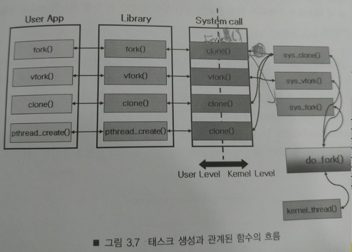
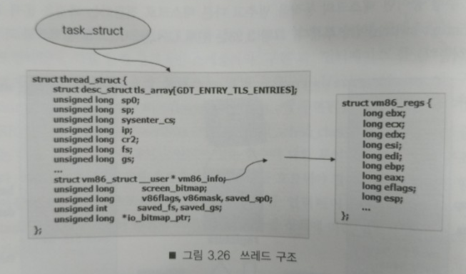

### 목차 
  - LINUX(x86)에서의 PROCESS와 THREAD
  - JVM에서의 THREAD
  - JAVA 코딩
    - Thread
    - ThreadPool(while), ThreadPool(wait, notify) 
    - Future, ListenableFuture, CompletableFuture


#LINUX(x86)에서의 PROCESS와 THREAD
- JVM은 쓰레드를 직접 만들어 사용하지 않습니다.
  - [green threads](https://en.wikipedia.org/wiki/Green_threads)
  - native thread를 사용하기 때문에 java의 thread를 살펴보기전에 Linux를 기준으로 OS native thread를 살펴보자.
- 프로그램
  - elf(Executable and Linkable Format)
    - 궁금했다. 하드에 있는 파일은 어떻게 실행되는 것일까? 
    - [elf 설명](http://recipes.egloos.com/5011946)
    - 
<!--    -
```shell
  docker ps --all
  docker start 1a88797ebf83
  docker attach 1a88797ebf83
  cd /root
  vi a.c
```
-->

```c
#include <stdio.h>

int main() {
  printf("HELLO KSUG\n");
  return 0;
}
```
<!--
```shell
gcc -o a.o a.c
readelf -S a.o
vi a.o
:%!xxd to switch into hex mode
:%!xxd -r to exit from hex mode
```
-->
```shell
# gcc -o a.o a.c
# readelf -S a.o

Section Headers:
  [Nr] Name              Type             Address           Offset
       Size              EntSize          Flags  Link  Info  Align
  [13] .text             PROGBITS         0000000000400490  00000490
       0000000000000242  0000000000000000  AX       0     0     16
  [15] .rodata           PROGBITS         00000000004006e0  000006e0
       0000000000000025  0000000000000000   A       0     0     4
  [24] .data             PROGBITS         0000000000601038  00001038
       0000000000000010  0000000000000000  WA       0     0     8
  [25] .bss              NOBITS           0000000000601048  00001048
```

- process 
  - [process wiki](https://ko.wikipedia.org/wiki/%ED%94%84%EB%A1%9C%EC%84%B8%EC%8A%A4)
  - memory layout
  - 

  - https://gabrieletolomei.wordpress.com/miscellanea/operating-systems/in-memory-layout/

  - 

  - process는 elf file이 OS에 의해 메모리 로드된 상태이며 .text 섹션에 있는 instruction이 실행되는 것.
- thread
  - lightweight process
  - [쓰레드 정의 WIKI](https://ko.wikipedia.org/wiki/%EC%8A%A4%EB%A0%88%EB%93%9C) 
  - 스레드(thread)는 어떠한 프로그램 내에서, 특히 프로세스 내에서 실행되는 흐름의 단위를 말한다. 일반적으로 한 프로그램은 하나의 스레드를 가지고 있지만, 프로그램 환경에 따라 둘 이상의 스레드를 동시에 실행할 수 있다. 이러한 실행 방식을 멀티스레드(multithread)라고 한다.
  - 
<!--   
```c
#include <sys/types.h>
#include <unistd.h>
#include <stdio.h>
#include <stdlib.h>
#include <sys/syscall.h>
#include <sched.h>

void* thread_function(void* arg);

int main(void)
{

  printf("cpu count: %d\n", get_nprocs_conf());
  int cpu = sched_getcpu();
  printf("main: CPU(%d) PID(%d) TID(%d)\n", cpu, getpid(), pthread_self());

  pthread_t p_thread;
  int create_result = pthread_create(&p_thread, NULL, thread_function, NULL);
  create_result = pthread_create(&p_thread, NULL, thread_function, NULL);
  create_result = pthread_create(&p_thread, NULL, thread_function, NULL);
  create_result = pthread_create(&p_thread, NULL, thread_function, NULL);

  pthread_join(p_thread, NULL);

  return 0;
}

void* thread_function(void* arg){
  int cpu = sched_getcpu();
  printf("sub : CPU(%d) PID(%d) TID(%d)\n", cpu, getpid(), syscall(__NR_gettid));
  sleep(10);
}
```  
```shell
gcc -o pthread_create.o pthread_create.c  -pthread
```

-->
  - 
  - 
  ```shell
root@1a88797ebf83:/# ulimit -a
core file size          (blocks, -c) 0
data seg size           (kbytes, -d) unlimited
scheduling priority             (-e) 0
file size               (blocks, -f) unlimited
pending signals                 (-i) 7763
max locked memory       (kbytes, -l) 82000
max memory size         (kbytes, -m) unlimited
open files                      (-n) 1048576
pipe size            (512 bytes, -p) 8
POSIX message queues     (bytes, -q) 819200
real-time priority              (-r) 0
stack size              (kbytes, -s) 8192
cpu time               (seconds, -t) unlimited
max user processes              (-u) unlimited
virtual memory          (kbytes, -v) unlimited
file locks                      (-x) unlimited
```
  - 

clone은 task_struct를 만듬. => kernel입장에서는 task라 부름.
process는 thread를 가질수 있고 thread == task

- task state
  - 프로세스의 상태
    - 생성(create) : 프로세스가 생성되는 중이다.
    - 실행(running) : 프로세스가 CPU를 차지하여 명령어들이 실행되고 있다.
    - 준비(ready) : 프로세스가 CPU를 사용하고 있지는 않지만 언제든지 사용할 수 있는 상태로, CPU가 할당되기를 기다리고 있다. 일반적으로 준비 상태의 프로세스 중 우선순위가 높은 프로세스가 CPU를 할당받는다.
    - 대기(waiting) : 보류(block)라고 부르기도 한다. 프로세스가 입출력 완료, 시그널 수신 등 어떤 사건을 기다리고 있는 상태를 말한다.
    - 종료(terminated) : 프로세스의 실행이 종료되었다.
  - 
  - read -> running -> blocked(io 시작) -> (io완료 시그널)waiting -> running -> terminated
    <!--- -->
  <!--- -->

- task schduler
 - [참조 url](http://www.informit.com/articles/article.aspx?p=370047)
  - 
  - 

  - [tss 참조링크](http://lxr.free-electrons.com/source/arch/x86/include/asm/processor.h#L248)

  - 

# JVM
- JVM Internal
  - 
  - jvm stack size 1024 KB [JVM default stack size - IBM ](https://www.ibm.com/support/knowledgecenter/SSYKE2_7.1.0/com.ibm.java.lnx.71.doc/diag/appendixes/defaults.html)
  - [jvm thread stack size config](http://xmlandmore.blogspot.com/2014/09/jdk-8-thread-stack-size-tuning.html )

--------------------------------------

# java code

> 쓰레드 기본 코드
```java
package examples.p01;

import lombok.*;

public class SimpleThread {
    @SneakyThrows
    public static void main(String[] args) throws InterruptedException {
        String message = "Hello KSUG";
        ThreadSample t1 = new ThreadSample(message);

        // main thread가 중요한 이유
//        t1.setDaemon(true);
        t1.start();
//        t1.join();

        Thread t2 = new Thread(new Runnable() {
            @Override
            @SneakyThrows
            public void run() {
                Thread.sleep(100);
                System.out.println("==============================");
                System.out.println("message from Runnable: " + message);
                System.out.println("==============================");

                Thread t = Thread.currentThread();
                long id = t.getId();
                String name = t.getName();
                int priority = t.getPriority();
                Thread.State state = t.getState();
                ThreadGroup threadGroup = t.getThreadGroup();
                String groupName = threadGroup.getName();
                ThreadGroup parent = t.getThreadGroup().getParent();
                String parentName = parent.getName();

                System.out.println("id: " + id);
                System.out.println("namd :" + name);
                System.out.println("priority: " + priority);
                System.out.println("state: " + state);
                System.out.println("threadGroup.name : " + groupName);
                System.out.println("parentName : " + parentName);

                Thread.sleep(1000);
            }
        });
//        t2.setDaemon(true);

        t2.start();
//        t2.join();

        System.out.println("exit main thread");
    }

}

class ThreadSample extends Thread {

    private String message;

    public ThreadSample(String message) {
        this.message = message;
    }

    @Override
    @SneakyThrows
    public void run() {
        Thread.sleep(500);
        System.out.println("==============================");
        System.out.println("message from ThreadSample: " + message);
        System.out.println("==============================");


        Thread t = Thread.currentThread();
        long id = t.getId();
        String name = t.getName();
        int priority = t.getPriority();
        State state = t.getState();
        ThreadGroup threadGroup = t.getThreadGroup();
        String groupName = threadGroup.getName();
        ThreadGroup parent = t.getThreadGroup().getParent();
        String parentName = parent.getName();

        System.out.println("id: " + id);
        System.out.println("namd :" + name);
        System.out.println("priority: " + priority);
        System.out.println("state: " + state);
        System.out.println("threadGroup.name : " + groupName);
        System.out.println("parentName : " + parentName);

        Thread.sleep(1000);
    }
}

```

> 쓰레드풀 코드
```
package examples.p02;

import java.util.*;
import java.util.concurrent.*;

import lombok.*;
import lombok.extern.slf4j.*;

@Slf4j
public class ThreadPoolExample {

    public static void main(String[] args) throws InterruptedException {
        int THREAD_LIMIT = 4;
        SimpleThreadPool pool = new SimpleThreadPool(THREAD_LIMIT);
        Runnable r = new Runnable() {
            @SneakyThrows
            @Override
            public void run() {
                log.debug("Hello KSUG");
                Thread.sleep(100);
            }
        };
        int i =0;
        while(true) {
            pool.submit(r);
            if(i != 0 && i % THREAD_LIMIT == 0) Thread.sleep(100);

            i++;

        }
    }

}

@Slf4j
class SimpleThreadPool {
    private int threadLimit;
//    Queue<Runnable> workQueue = new ConcurrentLinkedQueue<>();
    Queue<Runnable> workQueue = new LinkedList<>();

    public SimpleThreadPool(int threadLimit) {
        this.threadLimit = threadLimit;
        for(int i=0; i< threadLimit; i++) {
            new WorkThread(this.workQueue).start();
        }
    }

    public void submit(Runnable r) {
        log.info("submit");
        this.workQueue.add(r);
    }

}

@Slf4j
class WorkThread extends Thread {
    Queue<Runnable> workQueue;

    public WorkThread(Queue<Runnable> workQueue) {
        this.workQueue = workQueue;
    }

    @Override
    public void run() {
        while(true) {
//            synchronized (workQueue) {
                if(!workQueue.isEmpty()) {
                    Runnable r = workQueue.poll();
                    // NPE 발생해서 위에서 synchronized 추가
                    if(r != null) r.run();
                }
//            }

        }
    }
}
```

> 이전 쓰레드풀 코드 수정 - wait, block, synchronized 사용
```
package examples.p03;

import java.util.*;
import lombok.*;
import lombok.extern.slf4j.*;

@Slf4j
public class ThreadPoolUpgradeExample {

    @SneakyThrows
    public static void main(String[] args) {
        final int THREAD_LIMIT = 3;

        SimpleThreadPool pool = new SimpleThreadPool(THREAD_LIMIT);
        Runnable r = new Runnable() {
            @SneakyThrows
            public void run() {
                log.debug("Hello KSUG");
                Thread.sleep(100);
            }
        };

        int i = 0;
        while(true) {
            pool.submit(r);
            if(i != 0 && i % THREAD_LIMIT == 0) Thread.sleep(100);
            
            i++;
        }
    }
}

@Slf4j
class SimpleThreadPool {
    private int threadLimit;

    Object notifier = new Object();
//    Queue<Runnable> workQueue = new ConcurrentLinkedQueue<>();
    Queue<Runnable> workQueue = new LinkedList<>();

    public SimpleThreadPool(int threadLimit) {
        this.threadLimit = threadLimit;
        for(int i=0; i < threadLimit; i++) {
             new WorkThread(this.workQueue, notifier).start();
        }
    }

    public void submit(Runnable r) {
        this.workQueue.add(r);
        log.info("submit");

        //java.lang.IllegalMonitorStateException
        synchronized( notifier ) {
            log.warn("notifier notify");
            notifier.notify();
        }
    }

}

@Slf4j
class WorkThread extends Thread {
    Queue<Runnable> workQueue;
    Object notifier;

    public WorkThread(Queue<Runnable> workQueue, Object notifier) {
        this.workQueue = workQueue;
        this.notifier = notifier;
    }

    @Override
    @SneakyThrows
    public void run() {
        while(true) {
            if(!workQueue.isEmpty()) {
                Runnable r = workQueue.poll();
                if(r != null) r.run();
            } else {
                synchronized (notifier){
                    log.error("notifier wait");
                    notifier.wait();
                }
            }
        }
    }
}
```

> Future 구현 
```
package examples.p04;

import java.util.*;
import java.util.concurrent.*;

import lombok.*;
import lombok.extern.slf4j.*;

@Slf4j
public class FutureExample {

    public static void main(String[] args) throws InterruptedException, ExecutionException {
        SimpleThreadPool pool = new SimpleThreadPool(3);
        Callable<String> callback = () -> {
            Thread.sleep(100);
            log.debug("Callable");
            return "Hello KSUG";
        };
        List<SimpleFuture> list = new ArrayList<>();
        for(int i =0; i< 100; i++) {

            SimpleFuture<String> simpleFuture = pool.submit(callback);
            list.add(simpleFuture);
        }

        for (SimpleFuture<String> future : list) {
            log.error(future.get());
        }
    }
}

@Slf4j
class SimpleFuture<T> implements Runnable  {
    private Object futureNotifier = new Object();
    private T result;
    private Callable c;

    public SimpleFuture(Callable c) {
        this.c = c;
    }

    @SneakyThrows
    public T get() {
        if(result == null) {
            synchronized (futureNotifier) {
                log.error("get wait");
                futureNotifier.wait();
            }
        }
        return result;
    }

    @Override
    @SneakyThrows
    public void run() {
        result = (T)c.call();
        synchronized (futureNotifier) {
            log.warn("futureNotifier notify");
            futureNotifier.notify();
        }
    }

}

class SimpleThreadPool {
    private int threadLimit;

    Object notifier = new Object();
    Queue<SimpleFuture> workQueue = new ConcurrentLinkedQueue<>();
//    Queue<SimpleFuture> workQueue = new LinkedList<>();

    public SimpleThreadPool(int threadLimit) {
        this.threadLimit = threadLimit;
        for(int i=0; i < threadLimit; i++) {
             new WorkThread(this.workQueue, notifier).start();
        }
    }

    public <T> SimpleFuture<T> submit(Callable<T> c) {
        SimpleFuture<T> f = new SimpleFuture<>(c);
        workQueue.add(f);
        synchronized( notifier ) {
            notifier.notify();
        }
        return f;
    }

}

class WorkThread extends Thread {
    Queue<SimpleFuture> workQueue;
    Object notifier;

    public WorkThread(Queue<SimpleFuture> workQueue, Object notifier) {
        this.workQueue = workQueue;
        this.notifier = notifier;
    }

    @Override
    @SneakyThrows
    public void run() {
        while(true) {
            if(!workQueue.isEmpty()) {
                SimpleFuture f = workQueue.poll();
                f.run();
            } else {
                synchronized (notifier){
                    notifier.wait();
                }
            }
        }
    }
}
```
> Spring에서 만든 ListenableFuture - 너무 길어서 코드 시현은 못함.
```
package examples.p05;


import org.springframework.core.task.*;
import org.springframework.scheduling.concurrent.*;
import org.springframework.util.concurrent.*;

import java.util.*;
import java.util.concurrent.*;

import lombok.*;
import lombok.extern.slf4j.*;

@Slf4j
public class ListenableFutureExample {
    @SneakyThrows
    public static void main(String[] args) {
        Callable<String> c0 = () -> {
            log.info("c0");
            return "HELLO ";
        };
        SimpleAsyncTaskExecutor pool = new  SimpleAsyncTaskExecutor();
        ListenableFuture<String> f1= pool.submitListenable(c0);

        ListenableFutureResult<String> result = new ListenableFutureResult<>();

        f1.addCallback(s1 -> {
            log.info("s1");
            Callable<String> c1 = () -> {
                log.info("c1");
                return  s1 + " K";
            };
            ListenableFuture<String> f2= pool.submitListenable(c1);
            f2.addCallback(s2 -> {
                log.info("s2");
                Callable<String> c2 = () -> {
                    log.info("c2");
                    return  s2 + "S";
                };
                ListenableFuture<String> f3 = pool.submitListenable(c2);
                f3.addCallback(s3 -> {
                    log.info("s3");
                    Callable<String> c3 = () -> {
                        log.info("c3");
                        return  s3 + "U";
                    };
                    ListenableFuture<String> f4 = pool.submitListenable(c3);
                    f4.addCallback(s4 -> {
                        log.info("s4");
                        result.complete(s4 + "G");
                    }, e4 -> {});
                }, e2 -> {});
            }, e2 -> {});
        }, e1 -> {});

        String msg = result.get();
        log.info(msg);
    }
}

@Slf4j
class ListenableFutureResult<T> {
    private T result;
    private Object notifier = new Object();
    public void complete(T result) {
        synchronized (notifier) {
            log.error("notify");
            notifier.notify();
        }
        this.result = result;
    }
    @SneakyThrows
    public T get() {
        if(result == null) {
            synchronized (notifier) {
                log.error("wait");
                notifier.wait();
            }
        }
        return result;
    }
}
```

> CompletableFuture
```
package examples.p06;

import java.util.concurrent.*;

import lombok.*;
import lombok.extern.slf4j.*;

@Slf4j
public class CompletableFutureExample {

    @SneakyThrows
    public static void main(String[] args) {
        CompletableFuture<String> cf = CompletableFuture
                .completedFuture("Hello")
                .thenApply(x -> {
                    log.info(x);
                    return x + " K";
                })
                .thenApplyAsync(x -> {
//                .thenApply(x -> {
                    log.error(x);
                    return x + "S";
                })
                .thenApply(x -> {
                    log.info(x);
                    return x + "U";
                })
                .thenApply(x -> {
                    log.info(x);
                    return x + "G";
                });

        log.warn(cf.get());
    }

}
```

--------------------------------------


참고 URL
- [jvm internal](http://www.artima.com/insidejvm/ed2/jvm2.html)
- [Chapter 6. I/O Multiplexing: The select and poll Functions¶ ](https://notes.shichao.io/unp/ch6/)
- [jvm default setting memory size](https://www.ibm.com/support/knowledgecenter/SSYKE2_7.1.0/com.ibm.java.lnx.71.doc/diag/appendixes/defaults.html)